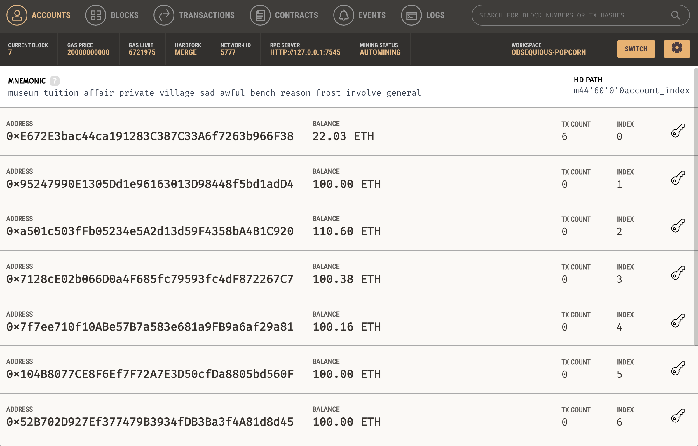
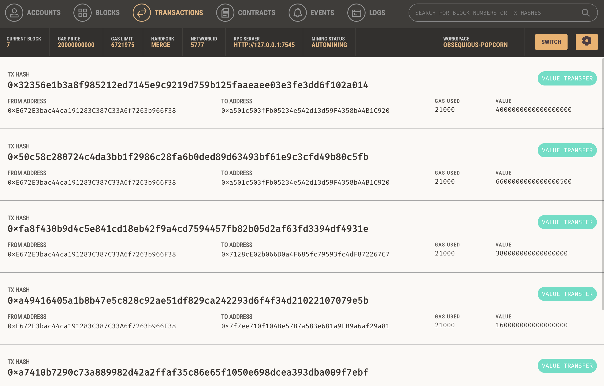
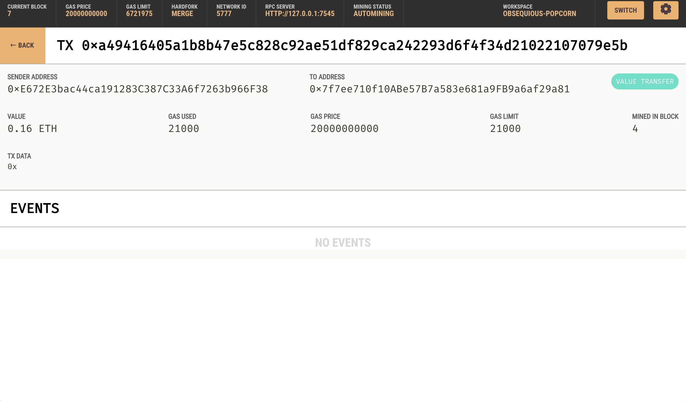

Blockchain Wallet

### Project 

This project includes code that enables customers to send cryptocurrency payments to fintech professionals. It shows the code and tests with the perspective of a KryptoJobs2Go customer who is using the application to find a fintech professional and pay them for their work.

### Project Details

`krypto_jobs.py` : It contains the code associated with the web interface of the application.

`crypto_wallet.py`: This file contains the Ethereum transaction functions. It is imported into `krypto_jobs.py` and is used throughout.

Intertwining the files enables interaction with Ganache blockchain software to create realisitc blockchain interactions. 

From the perspective of a KryptoJobs2Go customer the code works as follows:

* Generate a mnemonic seed phrase provided by Ganache for use in an Ethereum Account.

* Fetch and display the account balance associated with your Ethereum account address.

* Calculate the total value of an Ethereum transaction, including the gas estimate, that pays a KryptoJobs2Go candidate for their work.

* Digitally sign a transaction that pays a KryptoJobs2Go candidate, and send this transaction to the Ganache blockchain.

* Review the transaction hash code associated with the validated blockchain transaction.

### Results

1. Blockchain Results
   
3. Transactions in Blocks
   
5. Transactions Details
   
